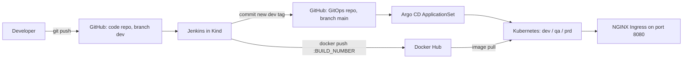

# End-to-End DevOps Project (Flask)

A small Flask API that goes through a complete local CI/CD and GitOps flow:

Developer push → Jenkins (lint, security scan, tests, Docker build) → Docker Hub → GitOps repository → Argo CD → Kubernetes (Kind) → Service → NGINX Ingress

- Code repository (this one): <https://github.com/sbaransi/end-to-end-devops-project>
- GitOps repository: <https://github.com/sbaransi/end-to-end-devops-gitops>
- Docker Hub image: <https://hub.docker.com/r/sammybaransi537/end-to-end-devops-project>

Everything runs on one laptop: Windows 11, WSL2 Ubuntu, Docker Desktop and a Kind cluster named `end-to-end-lab`. No cloud services are used.

## Architecture



## Repository layout

| Path | What it is |
|---|---|
| `app.py` | Flask application |
| `requirements.txt` | Python packages for the app |
| `tests/test_app.py` | Pytest tests |
| `Dockerfile` | Multi-stage image for the app |
| `Jenkinsfile` | CI/CD pipeline |
| `helmchart/` | Helm chart for the manual Helm deploy |
| `jenkins-custom/` | Jenkins controller image and Helm values |
| `jenkins-agent-custom/` | Jenkins build agent image (Python, Git, Docker CLI) |

## The application

The app listens on port **5001** (set by the `FLASK_PORT` environment variable).

| Endpoint | Response |
|---|---|
| `GET /` | HTML welcome message |
| `GET /health` | `{"application": "running", "status": "healthy"}` |

### Run with Python

```bash
python3 -m venv .venv
. .venv/bin/activate
pip install -r requirements.txt
python app.py
```

In another terminal:

```bash
curl http://localhost:5001/
curl http://localhost:5001/health
```

### Run the checks locally

These are the same checks Jenkins runs:

```bash
. .venv/bin/activate
pip install flake8 bandit pytest
flake8 app.py tests
bandit -r app.py
python -m pytest -v
```

Use `python -m pytest` (not just `pytest`) so Python can find `app.py` in the project folder.

### Run with Docker

```bash
docker build -t end-to-end-devops-project:local .
docker run --rm -p 5001:5001 end-to-end-devops-project:local
curl http://localhost:5001/health
```

## Jenkins pipeline

| Stage | What it does |
|---|---|
| Checkout | Gets the code from GitHub (branch `dev`) |
| Install Dependencies | Creates a virtual environment and installs the app packages plus Flake8, Bandit and Pytest |
| Parallel Checks | **Linting** (Flake8) and **Security Scan** (Bandit) run at the same time |
| Unit Tests | Runs Pytest |
| Build Docker Image | `docker build -t end-to-end-devops-project:<build number> .` |
| Push to Docker Hub | Logs in with Jenkins credentials, pushes `sammybaransi537/end-to-end-devops-project:<build number>` and `:latest` |
| Update GitOps Repository | Clones the GitOps repo, sets `tag:` in `end-to-end-devops-project/dev/values.yaml` to the build number, commits and pushes to `main` |
| Post actions | `docker logout` and removal of the local images the build created |

The Docker Hub username is not written in the Jenkinsfile. It comes from the `dockerhub-creds` credential.

### Jenkins credentials

Create these in **Manage Jenkins → Credentials → System → Global credentials**. Never put them in Git.

| ID | Kind | Username | Password |
|---|---|---|---|
| `dockerhub-creds` | Username with password | Docker Hub username | Docker Hub access token (Read & Write) |
| `github-creds` | Username with password | `sbaransi` | GitHub fine-grained token for `end-to-end-devops-gitops` only, **Contents: Read and write** |

Jenkins shows both tokens as `****` in the build log.

### Jenkins job

- Type: **Pipeline**
- Definition: **Pipeline script from SCM**, Git
- Repository URL: `https://github.com/sbaransi/end-to-end-devops-project.git`
- Branch: `*/dev`
- Script path: `Jenkinsfile`

Start builds with **Build Now**. GitHub webhooks cannot reach a local cluster.

## Local Kubernetes setup

### 1. Kind cluster

Save this as `kind-config.yaml` (outside the repository is fine):

```yaml
kind: Cluster
apiVersion: kind.x-k8s.io/v1alpha4
name: end-to-end-lab
nodes:
  - role: control-plane
    kubeadmConfigPatches:
      - |
        kind: InitConfiguration
        nodeRegistration:
          kubeletExtraArgs:
            node-labels: "ingress-ready=true"
    extraPortMappings:
      - containerPort: 80
        hostPort: 8080
        protocol: TCP
      - containerPort: 443
        hostPort: 8443
        protocol: TCP
    extraMounts:
      - hostPath: /var/run/docker.sock
        containerPath: /var/run/docker.sock
```

```bash
kind create cluster --config kind-config.yaml
kubectl config current-context    # kind-end-to-end-lab
```

- Port 80 was already in use on this WSL machine, so host port **8080** goes to the Ingress controller.
- The Docker socket mount lets the Jenkins agent run `docker build` with Docker Desktop. This gives Jenkins builds full control of Docker on the laptop, which is fine for a private lab only.

On the corporate network, trust the Zscaler certificate inside the Kind node (see [Zscaler](#zscaler-corporate-network-only)):

```bash
docker cp ZscalerRootCA.pem end-to-end-lab-control-plane:/usr/local/share/ca-certificates/ZscalerRootCA.crt
docker exec end-to-end-lab-control-plane update-ca-certificates
docker exec end-to-end-lab-control-plane systemctl restart containerd
```

### 2. NGINX Ingress

```bash
helm upgrade --install ingress-nginx ingress-nginx \
  --repo https://kubernetes.github.io/ingress-nginx \
  --version 4.15.1 \
  --namespace ingress-nginx --create-namespace \
  --set controller.hostPort.enabled=true \
  --set controller.service.type=NodePort \
  --set controller.publishService.enabled=false
```

`publishService.enabled=false` gives every Ingress an address. Without it the Ingresses have no address and Argo CD shows the apps as Progressing forever.

### 3. Jenkins

Build the two custom images and load them into Kind (each folder needs its local `ZscalerRootCA.pem`):

```bash
docker build -t jenkins-zscaler:1.0 jenkins-custom/
docker build -t jenkins-agent-custom:1.0 jenkins-agent-custom/
kind load docker-image jenkins-zscaler:1.0 jenkins-agent-custom:1.0 --name end-to-end-lab
```

Install Jenkins with Helm:

```bash
helm repo add jenkins https://charts.jenkins.io
helm repo update
helm upgrade --install jenkins jenkins/jenkins --version 5.9.58 \
  --namespace jenkins --create-namespace \
  -f jenkins-custom/jenkins-custom-image.yaml
```

Open the dashboard at <http://127.0.0.1:8082> with user `admin`:

```bash
kubectl port-forward -n jenkins svc/jenkins 8082:8080
kubectl exec -n jenkins -c jenkins jenkins-0 -- cat /run/secrets/additional/chart-admin-password && echo
```

The agent image adds the `jenkins` user to group id 1001, the group that owns `/var/run/docker.sock` on this machine. Check yours with `getent group docker`.

### 4. Argo CD

```bash
kubectl create namespace argocd
kubectl apply --server-side -n argocd \
  -f https://raw.githubusercontent.com/argoproj/argo-cd/v3.5.3/manifests/install.yaml
kubectl apply -f ../end-to-end-devops-gitops/applicationsets/flask-applicationset.yaml
```

`--server-side` is needed because the ApplicationSet CRD is too large for a normal `kubectl apply`.

Open the UI at <https://localhost:8081> (accept the self-signed certificate warning) with user `admin`:

```bash
kubectl port-forward -n argocd svc/argocd-server 8081:443
kubectl get secret argocd-initial-admin-secret -n argocd -o jsonpath='{.data.password}' | base64 -d && echo
```

The environments are described in the [GitOps repository README](https://github.com/sbaransi/end-to-end-devops-gitops).

## Manual Helm deploy (Helm exercise)

`helmchart/` deploys one copy of the app to the `default` namespace on host `devops.local`. It uses a locally built image loaded into Kind. The dev, qa and prd environments use the Docker Hub image through GitOps instead.

```bash
docker build -t end-to-end-devops-project:latest .
kind load docker-image end-to-end-devops-project:latest --name end-to-end-lab
helm lint ./helmchart
helm upgrade --install flask-app ./helmchart
curl -H "Host: devops.local" http://127.0.0.1:8080/health
```

## Testing the deployed environments

```bash
kubectl get applications -n argocd
kubectl get deploy,pods,svc,endpoints,ingress -n dev
curl -H "Host: dev.devops.local" http://127.0.0.1:8080/
curl -H "Host: dev.devops.local" http://127.0.0.1:8080/health
```

For a browser, add this line to `/etc/hosts` in WSL and to `C:\Windows\System32\drivers\etc\hosts` in Windows:

```text
127.0.0.1 devops.local dev.devops.local qa.devops.local prd.devops.local
```

Then open <http://dev.devops.local:8080/health>.

## Git workflow

feature branch → dev → pull request → main

```bash
git switch dev
git pull
git switch -c feature/my-change
# edit, run the checks, then commit
git push -u origin feature/my-change
git switch dev
git merge --no-ff feature/my-change
git push origin dev            # then click Build Now in Jenkins
```

When dev works, open a pull request from `dev` to `main` on GitHub and merge it.

## Zscaler (corporate network only)

This laptop is behind Zscaler, which inspects HTTPS traffic with its own root certificate. Tools that don't trust that certificate fail with errors such as `x509: certificate signed by unknown authority` or `PKIX path building failed`.

The certificate (`ZscalerRootCA.pem`) is a local file. `.gitignore` ignores `*.pem` and `*.crt`, and it must never be committed.

| Where | How it is trusted |
|---|---|
| Kind node (image pulls) | Copied to `/usr/local/share/ca-certificates/`, then `update-ca-certificates` and a containerd restart |
| Jenkins controller (plugin downloads) | Imported into the Java truststore in `jenkins-custom/Dockerfile` |
| Jenkins agent (pip, git) | Added to the system certificate store in `jenkins-agent-custom/Dockerfile` |

On a normal network, skip the Kind node step and remove the certificate lines from both Jenkins Dockerfiles.

## Troubleshooting

| Problem | Cause and fix |
|---|---|
| `x509: certificate signed by unknown authority` when Kind pulls images | Zscaler. Trust the certificate in the Kind node |
| `PKIX path building failed` in Jenkins | Zscaler. Use the `jenkins-zscaler:1.0` controller image |
| Nothing answers on port 80 | Port 80 is taken on this machine. Use port 8080 |
| Argo CD apps stay `Progressing` | The Ingresses have no address. Install ingress-nginx with `controller.publishService.enabled=false` |
| ApplicationSet CRD error `metadata.annotations: Too long` | Install Argo CD with `kubectl apply --server-side` |
| `docker: command not found` in the Jenkins agent | On Debian 13 install `docker-cli`, not `docker.io` |
| `permission denied` on `/var/run/docker.sock` in Jenkins | The agent user must be in the socket's group (id 1001 here) |
| GitOps push fails with 403 | The GitHub token needs **Contents: Read and write** on the GitOps repository |
| Argo CD does not react to a Git change right away | It checks Git about every 3 minutes (no webhook) |
| `legacy builder is deprecated` in the build log | Harmless. The agent has no BuildKit, which this course does not use |

## Status

Verified:

- Jenkins runs every stage: checkout, Flake8 and Bandit in parallel, Pytest, Docker build, Docker Hub push, GitOps update.
- The pushed image can be pulled from Docker Hub, and the repository is public.
- Jenkins changes only the dev tag. Argo CD rolls out dev on its own, and qa and prd stay unchanged.
- Argo CD tests: automatic sync, replica change from Git, self-heal after a manual `kubectl scale`, image rollout.
- `GET /` and `GET /health` return 200 through the Ingress in dev, qa and prd.

Still to do:

- Final run with a change to `app.py`, from a feature branch to a rolled-out dev environment.
- Pull request from `dev` to `main` in this repository.

## Screenshots to add

- Jenkins: stage view of a successful build
- Jenkins: build log with the tokens shown as `****`
- Docker Hub: repository tags page
- GitHub: GitOps commit "Update dev image tag to N" by Jenkins CI
- Argo CD: the three applications Synced and Healthy
- Terminal: `kubectl get deploy,pods,svc,endpoints,ingress -n dev`
- Browser: <http://dev.devops.local:8080/health>
